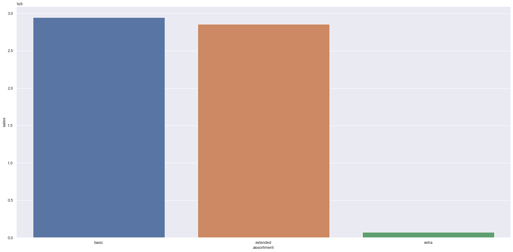
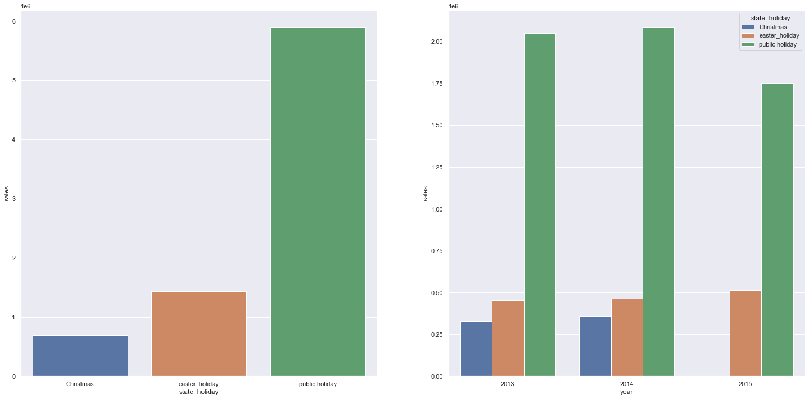
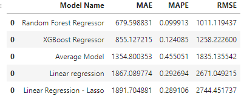
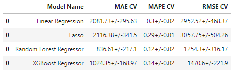
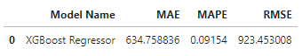
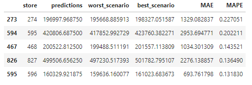
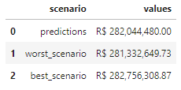
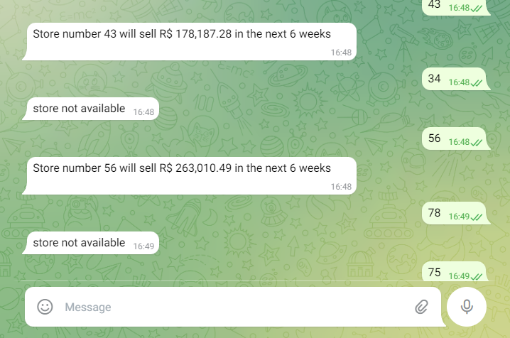

# Rossmann
</b>Este é um projeto construído com ferramentas de Machine Learning para prever as vendas de uma rede de farmácias nas próximas seis semanas. 

    

 

## 1. Sobre a Rossmann
A Rossmann é uma das maiores redes de drogaria da Europa, com cerca de 56.200 funcionários e mais de 4.000 lojas em diversos países. É uma empresa em expansão com um grande sortimento de produtos que são oferecidos as seus clientes, incluindo produtos próprios.
  
### 1.1. Problema de negócio
O CFO das Drogarias Rossmann solicitou uma previsão de vendas de cada loja para as próximas seis semanas, a fim de definir um orçamento para a reforma das lojas.
### 1.2. Premissas do negócio
- Os dias em que as lojas estão fechadas serão removidos da análise.
- Apenas lojas abertas e que possuam vendas serão consideradas.
- Para lojas que não possuem competidor próximo, será considerado uma distância muito maior do que a máxima presente nos dados analisados.

# Ferramentas Utilizadas

 - Python;
 - Jupyter Notebook;
 - Git e Github;
 - Heroku Cloud;
 - Algoritmos de Classificação e Regressão;
 - Pacotes de Machine Learning Sklearn e Scipy;
 - Técnicas de Seleção de Atributos e Redução de Dimensionalidade
 - Flask e Python API's

 # Atributos
| Atributos                        | Descrição                                                    |
| -------------------------------- | ------------------------------------------------------------ |
| Id                               | Um Id que representa uma dupla (Store, Date) dentro do conjunto de teste |
| Store                            | Um id único para cada loja                                   |
| Sales                            | O volume de vendas para qualquer dia                         |
| Customers                        | O número de clientes em um determinado dia                       |
| Open                             | Um indicador para saber se a loja estava aberta: 0 = fechada, 1 = aberta |
| StateHoliday                     | Indica um feriado estadual. Normalmente todas as lojas, com poucas exceções, fecham nos feriados estaduais. Observe que todas as escolas fecham nos feriados e finais de semana. a = feriado, b = feriado da Páscoa, c = Natal, 0 = Nenhum |
| SchoolHoliday                    | Indica se (Loja, Data) foi afetado pelo fechamento de escolas públicas |
| StoreType                        | Diferencia entre 4 modelos de loja diferentes: a, b, c, d  |
| Assortment                       | Descreve um nível de estoque: a = básico, b = extra, c = estendido |
| CompetitionDistance              | Distancia em metros do competidor mais proximo           |
| CompetitionOpenSince[Month/Year] | Dá o ano e mês aproximados em que o concorrente mais próximo foi aberto |
| Promo                            | Indica se uma loja está fazendo uma promoção naquele dia         |
| Promo2                           | Promo2 é uma promoção contínua e consecutiva para algumas lojas: 0 = a loja não está participando, 1 = a loja está participando |
| Promo2Since[Year/Week]           | Descreve o ano e a semana em que a loja começou a participar da Promo2 |
| PromoInterval                    | Descreve os intervalos consecutivos de início da promoção 2, nomeando os meses em que a promoção é iniciada novamente. Por exemplo. "Fev, maio, agosto, novembro" significa que cada rodada começa em fevereiro, maio, agosto, novembro de qualquer ano para aquela loja |

## 2. Estratégia de solução
O projeto foi desenvolvido através do método CRISP-DM, aplicando os seguintes passos:

**Passo 01 - Descrição dos Dados:** O objetivo foi conhecer os dados, utilizar métricas estatísticas para identificar outliers e analisar métricas estatísticas básicas como: média, mediana, máximo, mínimo, range, skew, kurtosis e desvio padrão.

**Passo 02 - Feature Engineering:** O objetivo desta etapa é obter novos atributos com base nas variáveis ​​originais, a fim de melhor descrever o fenômeno a ser modelado.

**Passo 03 - Filtragem de Variáveis:** O objetivo desta etapa foi filtrar linhas e excluir colunas que não são relevantes para o modelo ou não fazem parte do escopo do negócio.

**Passo 04 - Análise Exploratória de Dados:** O objetivo desta etapa foi explorar melhor os dados para encontrar insights, entender melhor relevância das variáveis no aprendizado do modelo.

**Passo 05 - Preparação dos Dados:** O objetivo desta etapa é preparar os dados para a aplicação do modelo de aprendizado de máquina.Foram utilizadas técnicas como Rescaling e Transformation, através de encodings e nature transformation.

**Passo 06 - Seleção de Variáveis:** O objetivo desta etapa foi selecionar os melhores atributos para treinar o modelo. Foi utilizado o algoritmo Boruta para fazer a seleção das variáveis.

**Passo 07 - Machine Learning Modeling:** O objetivo desta etapa é fazer os testes e o treinamento de alguns modelos de machine learning, para comparar suas respectivas performance e a partir daí, escolher o melhor modelo para o projeto. A técnica de Cross Validation foi usada para garantir a performance real sobre os dados selecionados.

**Passo 08 - Hyperparameter Fine Tunning:** O objetivo desta etapa é escolher os melhores valores para cada um dos parâmetros do modelo selecionado na etapa anterior.

**Passo 09 - Tradução e Interpretação do Erro:** O objetivo desta etapa é converter o desempenho do modelo em um resultado de negócios.

**Passo 10 - Deploy do Modelo em Produção:** O objetivo desta etapa é publicar o modelo em um ambiente de nuvem para que outras pessoas ou serviços possam usar os resultados para melhorar a decisão de negócios. A plataforma de aplicação em nuvem escolhida foi a Heroku.

  **Passo 11 - Telegram Bot:** O objetivo desta etapa é criar um bot no aplicativo do telegram, que possibilite consultar a previsão a qualquer momento.
  
## 3. Top insights
### **H1.** Lojas com maior sortimento deveriam vender mais.
**FALSA** - Lojas com maior **SORTIMENTO** vendem **MENOS**

  
### **H7.** Lojas deveriam vender mais no feriado de natal.
**FALSA** - No **natal** as lojas vendem ***MENOS**
  

## 4. Modelos utilizados
- Média;
- Regressão Linear;
- Regressão Linear com Regularização (Lasso);
- Random Forest Regressor;
- XGBoost Regressor.
  

## 5. Performance

### 5.1. Performance única dos modelos

  

### 5.2. Performance real dos modelos - Cross Validation

  

### 5.3. Performance XGBoost - Final

  

### 5.4. Performance de negócio

  

### 5.5. Desempenho do modelo versus valores de negócios

Além da previsão geral de vendas, também foi calculada a previsão de vendas para o pior e o melhor cenário..

  

## 6. Conclusão
Considerando o primeiro ciclo do CRISP-DS, o modelo final apresentou um desempenho aceitável, com um MAPE (Erro Médio Percentual Absoluto) de 10%. 

É possível acessar o modelo através de um bot no telegram(QRCode logo abaixo), com hospedagem no heroku, basta clicar no ícone do telegram abaixo.  

  

  

## 7. Lições aprendidas
- Nem sempre o melhor modelo é o que apresenta um menor erro;
- Uma boa EDA e um Cross Validation correto são de extrema importância para a solução do problema.
  

## 8. Próximos passos
- Criar novas hipóteses de negócio;
- Aprofundar mais na análise exploratória de dados de acordo com as hipóteses;
- Trabalhar pontualmente nas lojas que tiveram um outlier em suas previsões nesse primeiro ciclo;
- Estudar a viabilidade da implementação de um modelo de predição de customer.
  
